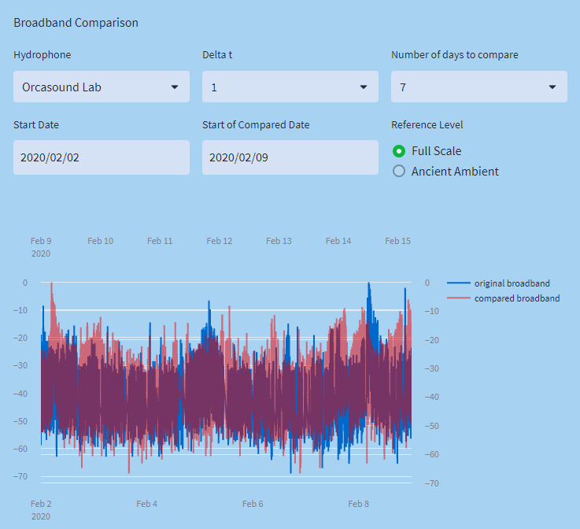
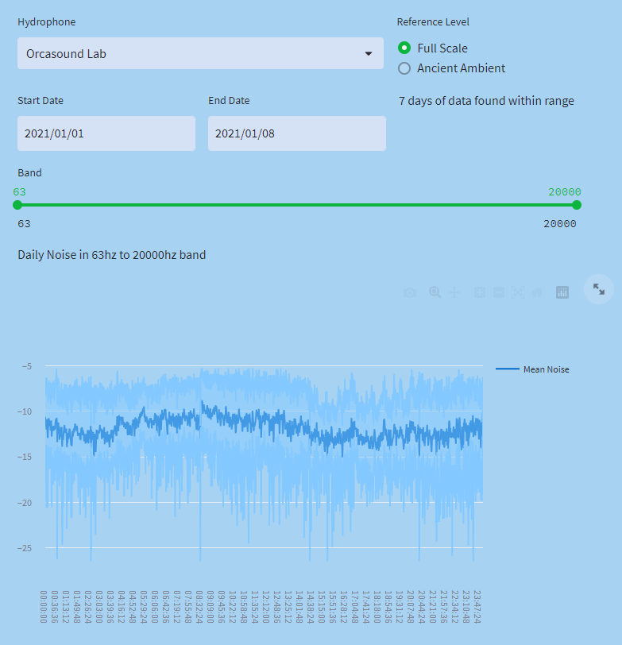
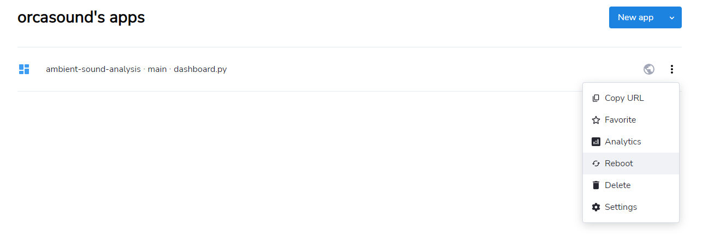

# Dashboard

This project comes with a dashboard built using [streamlit](www.streamlit.io). Streamlit provides for both local
display and cloud hosting.

## Display

Many pages come with the option to display data in either full scale or Ancient Ambient. Full scale will show noise levels directly from the hydrophones without adjustment. Because hydrophones are uncalibrated, this is primary usefull for relative comparisons on the same hydrophone.

Ancient Ambient will display noise levels realtive to the _ancient ambient_ noise, defined as the 5th percentile of broadband noise over the past month. This provides a more stable baseline and can help compare between hydrophones.

### Broadband Comparison

The broadband comparison page allows for comparing broadband noise levels across different time periods. Select a hydrophone, interval and number of days to generate a line chart of broadband noise. Then select two start dates for comparison.

### Daily Trends

This page allows for looking at the daily seasonality of noise levels in different bands. Choose a start date and end date to analyize noise over. Then, if desired, adjust the band slider to focus on a specific frequency band for analysis.

The first will show the mean noise across the time period by time of day. The shaded region shows the full range (min to max) of noise levels for that time over the period. All values are smoothed with 1 minute rolling windows.

The second image shows the average noise levels for each day in the desird range.

### Spectrograms

This page can be used to generate spectrograms of specific time-ranges. Spectrograms are built directly from the raw data and not from the archived PSDs, so other intervals and frequency bands can be used that are not generally available.

## Adjusting

### Running

The streamlit dashboard can be run locally using

`python -m streamlit run dashboard.py`

This will run the dashboard on an open local port that can be viewed in the browser.

### Using streamlit

Streamlit provides a very simply, pythonic way to build dashboard. To add text, simply use `st.write` and pass in any html or text.

`st.write("# Welcome to The Orcasound Ambient Noise Dashboard!")`

To add a graph, generate a figure and plot it using `st.plotly_chart` to make an interactive graph, or `st.pyplot` to add a static pyplot figure. Note that even matplotlib pyplot figures can be passed to `st.plotly_chart`, and will be automatically converted to interactive charts.

More details can be found in the [streamlit documentation](https://docs.streamlit.io/library/get-started)

### Adding a page

Pages can be added to the dashboard just by adding a new .py file in the pages directory. After adding, a new tab with the name of the file will appear on the dashboard, and the file will be run and output any streamlit code found.

## Hosting

This dashboard is currently hosted on [Streamlit Community Cloud](https://streamlit.io/cloud) and can be found [here](https://orcasound-ambient-sound-analysis-dashboard-boh8ls.streamlit.app/). This provides free public hosting, and is directly connected to the repository. Any changes pushed to the main branch will automatically be deployed to the cloud.

The cloud dashbaord is assocciated with the Orcasound group in github: any member of the group can edit, restart and delete the ccloud deployment once connecting their github to their free streamlit cloud login.

The free hosted level only has 1 GB ram, and will crash if more than this is attempted. Once crashed, it must be restarted from the admin page.

The dashboard will open at localhost.
