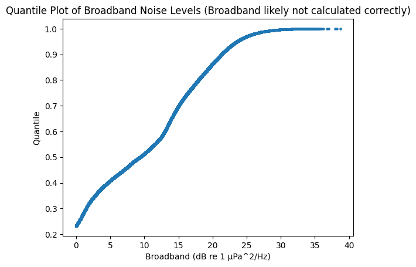

# Power Spectral Density Parquet File Retrieval and Analysis Functionality

These modules facilitate the retrieval of parquet files stored on AWS S3 of hydrophone power spectral density and broadband sound level 
and include functionality to analyze that sound data.

## partitioned_accessor

Accessor uses the python polars library to retrieve partitioned parquet files using lazy loading for fast on-demand data retrieval.

Current partition structure: 
*psd/hydrophone=###/year=####/month=##/day=##/*
*broadband/hydrophone=###/year=####/month=##/day=##/*

### Dependencies

* Requires AWS CLI on PATH, (external install)

### Current analytical metrics 

* communication band broadband
* echolocation band broadband
* Quantile vs Db range of broadband



### Example

```python
import datetime as dt
from orcasound_noise.analysis import ParitionedAcccessor
from orcasound_noise.utils import Hydrophone

ac_orcalab = PartitionedAccessor(Hydrophone.ORCASOUND_LAB)

start = dt.datetime(2026, 2, 5, 0, 0, 0)
end = dt.datetime(2026, 2, 5, 12, 0, 0)

psd_df = ac_orcalab.get_time_range(start, end, psd=True)
bb_df = ac_orcalab.get_time_range(start, end, psd=False)
```
