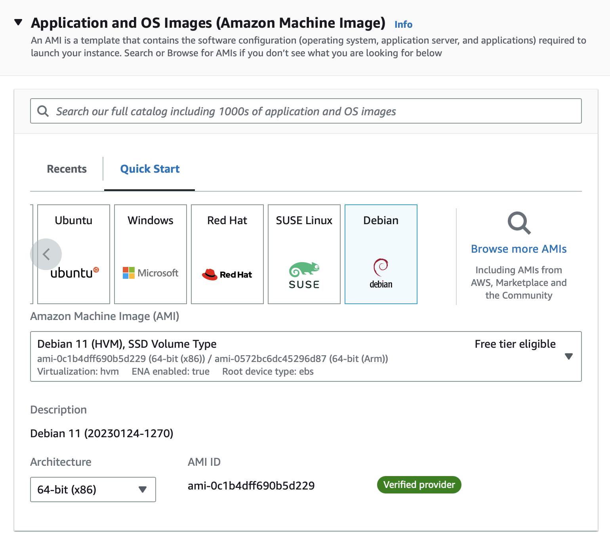
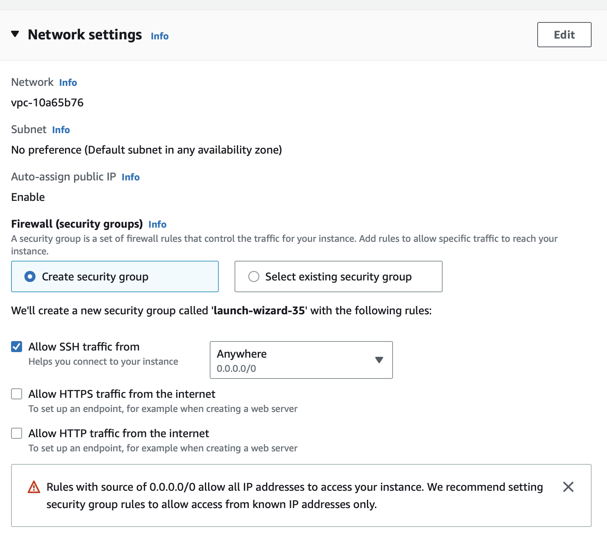
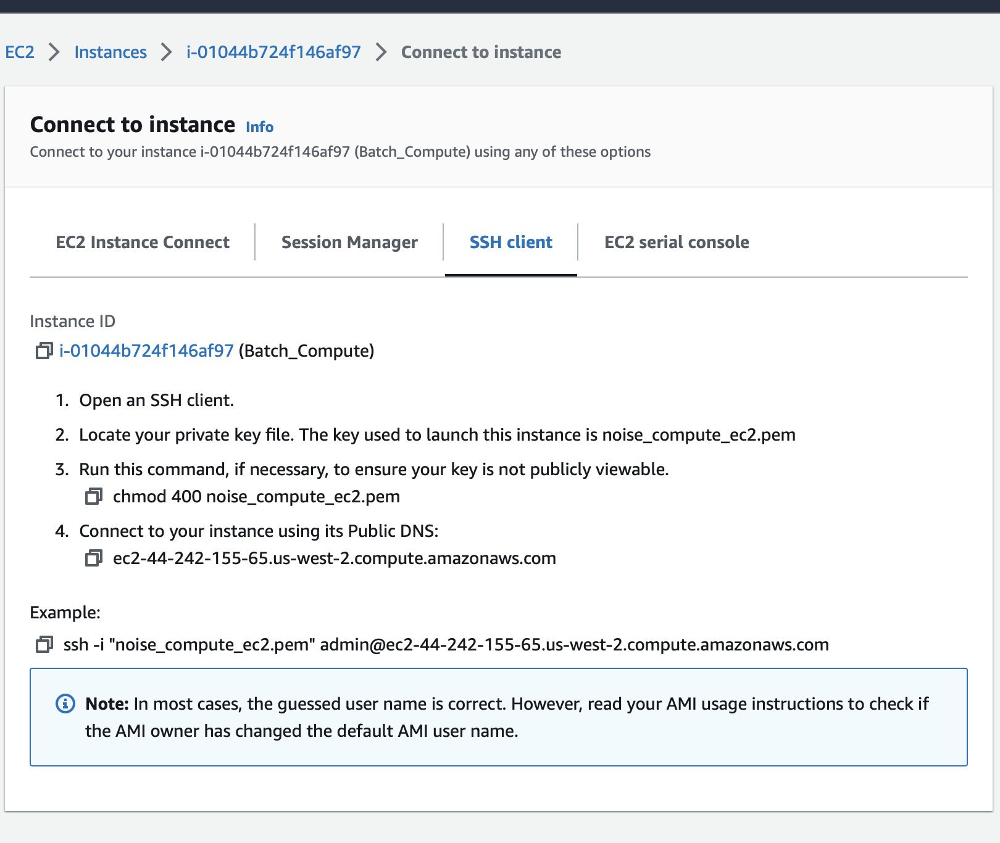

# Configuring an EC2 instance for file processing.

This guide was written 3/2023. AWS services and UIs change frequently, so please refer to their most recent
documentation if you feel this guide is insufficient or dated.

Author: Grant Savage

## 1. Get Access
You will need to gain the necessary credentials to be able to create an EC2 instance and read data from S3. These are provided by the
admins of the orcasound AWS account, and typically provided in the form of adding IAM Roles to your personal IAM user.
## 2. Create the EC2 instance. 
   1. #### **Select the Debian AMI!** 
      By using the Debian version of Linux, we are able to
      easily install FFMPEG using apt. I'm sure it's possible to install this package without Debian, however I found
      that the Debian Linux to make this process very easy. Select the 64-bit x86 architecture.

         
   2. #### Size your instance.
      We use c4d.large. When sizing your instance, you must decide what is best for your workflow. 
   Converting .ts files into parquet using the Pipeline utilities is CPU bound and benefit from fast read/write speeds.
   **The c5d.large and c5ad.large are ideal options for this application.** These instances are compute focused and designed
   specifically for media processing.
   3. #### Create a Key pair login if needed.
   4. #### Set Network Setting:
      I used all the default settings.
      
   5. #### Configure Storage
      1. Note that the c5d family comes with SSD included. The c5d.large has a 75gb instance SSD. Depending on how much
         raw data you plan on storing at any one time, you may need more. Currently, 1 month of 1 minute .wav files
         represents ~220-260gb of data. I recommend provisioning the correct amount of storage for your needs. (Note,
         the current .wav file conversion is not optimized, future versions may require a fraction of the storage.) 
      
      2. **Important! We get billed for the storage EVEN WHEN THE EC2 INSTANCE IS STOPPED!** It is very important to
         terminate/delete the instance (and volume) once you are done. By default, the EBS volumes provisioned should be
         deleted automatically when the EC2 instance is terminated, but it never hurts to verify!
   6. #### Launch the Instance
   7. #### Apply a project tag to the instance
        Using tags helps the Orcasound team track expenses for specific projects.
## 3. Connect to the Instance.
   This guide uses SSH. When you click on the instance id in AWS console it will bring you to page with the instance
   information. In the top-right there should be a "Connect" button which will provide step-by-step SSH instructions.
   
## 4. Setup the Instance
1. #### Install ffmpeg, git, pip, pipenv & tmux
   pipenv is a personal choice, feel free to use a different python virtual environment tool.
   
   TMUX (terminal multiplexer) Allows you to easily open multiple terminals without having to SSH into the EC2 instance 
   multiple times. I use it because it allows processes that have been started to continue running on the container even 
   if the SSH connection is broken. This means I can put my computer to sleep while running long processes and reconnect 
   to the instance later in the day.
      
   `sudo apt update`

   `sudo apt install ffmpeg`
   
   `sudo apt install git`

   `sudo apt install python3-venv python3-pip`

   `sudo apt-get -y install pipenv`

   `sudo apt-get install tmux`
2. Configure your AWS credentials

    `aws configure` 

    follow the setup. we're in region us-west-2, default output format JSON.
5. #### clone ambient-sound-analysis repo

   `git clone https://github.com/orcasound/ambient-sound-analysis.git`
6. #### Start the TMUX session
   tmux is a powerful tool. [This S.O. post provides a decent overview](https://stackoverflow.com/questions/21193988/keep-server-running-on-ec2-instance-after-ssh-is-terminated)
   
   `tmux new-session -s session_name`

7. #### create virtual environment, install dependencies 
 
   `cd ambient-sound-analysis`
       
   `pipenv shell`

   `pip install -r requirements.txt`

   *Did the pipenv shell step fail? Try removing python3-virtualenv* `sudo apt-get remove python3-virtualenv`
## 5. Run the processing
   This may look different for your use case. For mine, I am going to leverage the ec2_batch.py file located in
   the aws_batch directory. 
   1. Edit the dates you want to analyze, edit the other parameters as well (hz bands, delta_t, delta_f, etc.)
      
      `cd src/aws_batch`

      `vim ec2_batch.py` I recommend googling vim commands if you're not familiar.
   2. If you're using my ec2_batch.py exactly as is, make some folders for the wav and pqt files.
   
      `mkdir wav_folder`
   
      `mkdir pqt_folder`
   3. Run the process.

      `python3 ec2_batch.py`

## 6. TERMINATE the Instance when you are done!
Do not overlook this step. Since these instances require a large amount of storage they can be quite expensive to leave
in a STOPPED state. If you plan on reusing the instance frequently you could likely create an image or template from the
existing instance. This would save on setup times without racking up large storage costs.

## Other Notes
If you find you are running out of space on your EC2 instance, you can expand the volume via the AWS console and then
attach the additional space to the existing partition. [See AWS docs](https://docs.aws.amazon.com/AWSEC2/latest/UserGuide/ebs-modify-volume.html?icmpid=docs_ec2_console)

To monitor the cpu and memory utilization of your instance I recommend using nmon. `sudo apt-get install nmon`