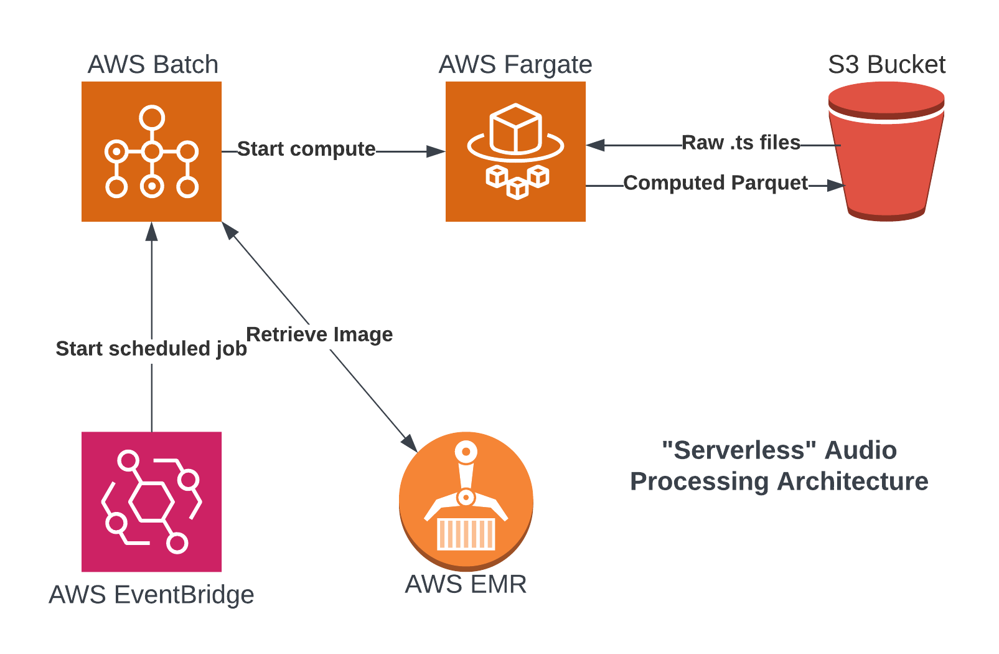

# Guide to re-create the batch service architecture

The audio-processing architecture was designed to achieve a low-touch and cost-effective solution. First, an AWS 
EventBridge CRON job kicks off the scheduled process. Next, AWS Batch retrieves a Docker image from EMR and provisions 
the needed Fargate instance. Fargate will then run the batch computations, saves the resulting parquet file to S3, and 
shuts itself down. The current batch computations take 14 hours per month per hydrophone.

The guide is currently a work-in-progress. Batch computations can be completed via the
[Configuring EC2 for file processing](Configuring_EC2_for_File_Processing.md) documentation.

Current challenges exist in configuring FFMPEG to successfully install within the docker container.